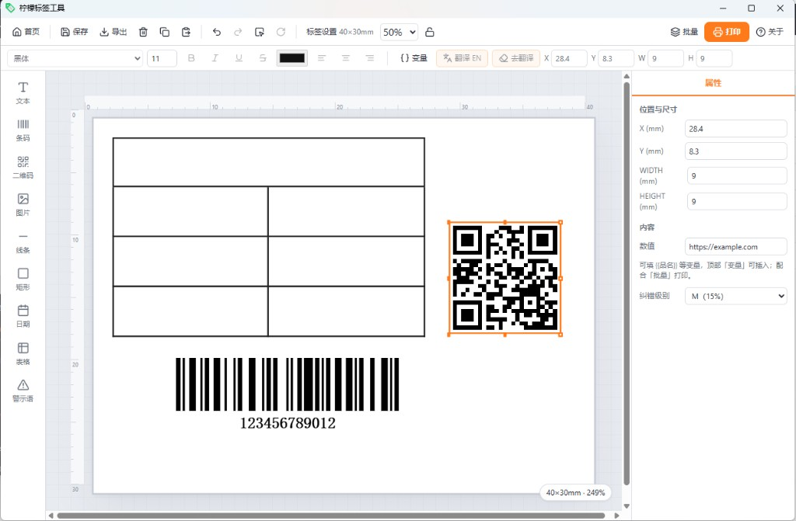
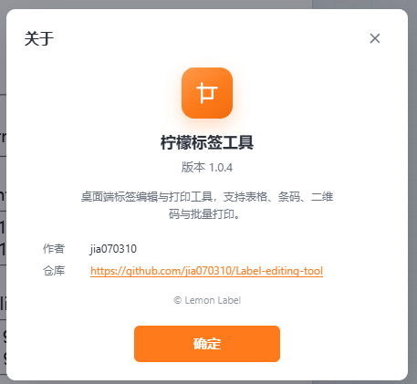

# 柠檬标签工具

桌面端标签编辑与打印工具（Electron），按毫米尺寸精确设计与输出。支持表格、条码、二维码、变量批量打印，以及系统字体与模板导入导出。

仓库：https://github.com/jia070310/Label-editing-tool  
作者：jia070310





## 下载

请到 [Releases](https://github.com/jia070310/Label-editing-tool/releases) 下载最新版：

- **安装包** `Lemon-Label-Tool-*-x64.exe`
- **绿色版** `Lemon-Label-Tool-*-portable.exe`

## 主要功能

- **新建模板**：按宽度 / 高度（mm）创建空白标签
- **表格**：增减行列、合并拆分、行高列宽、单元格独立字体与样式、双击编辑
- **元素**：文本、矩形、线条、条码、二维码、日期、警示语
- **字体**：读取本机系统字体；加粗 / 斜体 / 对齐等格式工具栏
- **变量与批量打印**：CSV 导入、自动翻译英文、预览后批量打印
- **打印**：Windows 按物理毫米尺寸直打
- **模板**：本地保存，支持导出 / 导入模板文件
- **关于**：工具栏可查看版本、作者与仓库地址

## 反馈日志

首页点击「反馈日志」，或在打印 / 崩溃报错时导出日志文本（仅本机保存，不联网）。把文件发给开发者即可协助排查。

## 开发启动

```bash
npm install
npm run desktop
```

仅前端预览（调试界面，不用于正式打印）：

```bash
npm run dev
```

PowerShell 若提示禁止运行脚本，可改用：

```powershell
npm.cmd run desktop
```

## 打包

```bash
npm run dist
```

产物输出到 `release/`。
